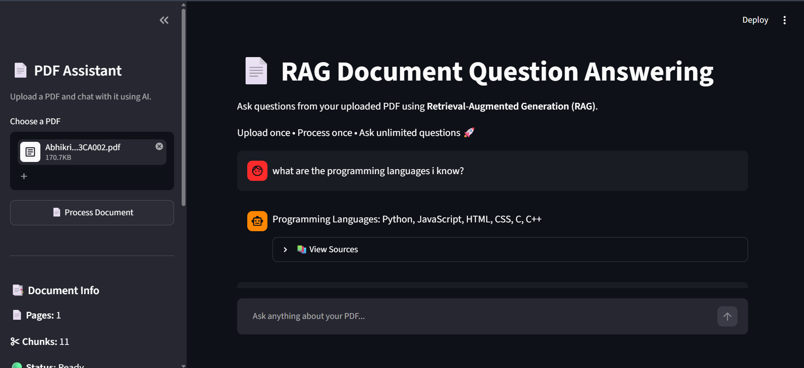

# 📄 RAG Document Question Answering System

A simple Retrieval-Augmented Generation (RAG) application built using **Streamlit**, **LangChain**, **FAISS**, **HuggingFace Embeddings**, and **Groq Llama 3.1**.

The application allows users to upload a PDF document and ask questions based only on the content of that document.

---

## Screenshot



## 🚀 Features

- 📄 Upload any PDF document
- ✂️ Automatic text chunking
- 🧠 Semantic embeddings using HuggingFace
- 📚 FAISS vector database
- 🔍 Context retrieval using similarity search
- 🤖 Answer generation using Groq Llama 3.1
- 💬 Interactive Streamlit chat interface
- 📖 View retrieved document sources

---

## 🛠️ Tech Stack

- Python
- Streamlit
- LangChain
- HuggingFace Embeddings
- FAISS
- Groq API
- Llama 3.1
- PyPDF

---

## 📂 Project Structure

```
RAG-Document-QA
│
├── app.py
├── rag.py
├── requirements.txt
├── README.md
├── .gitignore
└── .env (not uploaded)
```

---

## ⚙️ Installation

Clone the repository

```bash
git clone https://github.com/abhikriti15/RAG-Document-QA.git
```

Go inside the project

```bash
cd RAG-Document-QA
```

Create virtual environment

```bash
python -m venv venv
```

Activate environment

### Windows

```bash
venv\Scripts\activate
```

Install dependencies

```bash
pip install -r requirements.txt
```

Create a `.env` file

```env
GROQ_API_KEY=your_api_key_here
```

Run the application

```bash
streamlit run app.py
```

---

## 🏗️ RAG Workflow

```
PDF Upload
      │
      ▼
Load PDF
      │
      ▼
Text Chunking
      │
      ▼
Generate Embeddings
      │
      ▼
Store in FAISS
      │
      ▼
Retrieve Relevant Chunks
      │
      ▼
Groq Llama 3.1
      │
      ▼
Generate Answer
```

---

## 📸 Output

- Upload PDF
- Ask questions
- View AI-generated answers
- Inspect retrieved source chunks

---

## 🎯 Future Improvements

- Support multiple PDFs
- Chat history persistence
- PDF preview
- Citation highlighting
- Support DOCX and TXT files

---

## 👩‍💻 Author

**Abhikriti Saxena**

B.Tech CSE Student